# FRED Data Analysis Project - A Comprehensive Analysis of the U.S. Economy

_By David Nguyen, 04/08/2025_

This repository contains a mockup full-stack application that fetches a wide range of U.S. economic data from the FRED API, vectorizes it using Pinecone, and provides a chatbot interface for querying the data.
The application is built with TypeScript and uses Express for the backend. The frontend is a simple MUI-Powered React application that interacts with the backend API in a more user-friendly manner.

This project is divided into two main parts:

1. The [application](#1-the-full-stack-application):
   - A sample full-stack application that fetches a wide range of economic data from the FRED API, clean and preprocesses it, and stores it in a MongoDB database.
   - It also vectorizes the data using Pinecone and provides a chatbot with RAG (retrieval-augmented generation) capabilities.
   - The backend is built with TypeScript and uses Express for the server.
   - The frontend is a simple React application that interacts with the backend API.
   - Visit the [application section](#1-the-full-stack-application) below for setup instructions and commands to run the application.
2. The [analysis](#2-fred-economics-data-analysis-report):
   - A detailed analysis of the FRED economics data using regression models and plots.
   - The analysis is performed using TypeScript and the results are saved in the `backend` directory.
   - The analysis includes linear regression, polynomial regression, regression on daily percent change, and logarithmic regression.
   - The results are summarized in a report format, including charts and AI-generated & data-backed summaries.
   - Visit the [analysis section](#2-fred-economics-data-analysis-report) below for a detailed report on the FRED economic data analysis.


> **Motivation**: As a Computer Science & Economics double-major, I wanted to combine my interests in both fields and create a project that showcases my skills in full-stack development, data analysis, and machine learning, as well as in economics topics such as inflation, unemployment, and GDP growth. This project serves as a comprehensive portfolio piece that demonstrates my ability to work with real-world data and build a full-stack application from scratch.

---

# 1. The Full-Stack Application

## Table of Contents

1. [Live Deployment](#live-deployment)
2. [Technical Specifications](#technical-specifications)
3. [Local Setup Instructions](#local-setup-instructions)
4. [Instructions / Commands](#instructions--commands)
   - [To Run the Data Fetching & Vectorization Functionality](#to-run-the-data-fetching--vectorization-functionality)
   - [To Upsert Data to Pinecone](#to-upsert-data-to-pinecone)
   - [To Run the Query Pinecone Functionality](#to-run-the-query-pinecone-functionality)
   - [To Run the Chatbot Functionality](#to-run-the-chatbot-functionality)
   - [To Analyze FRED Data with Regressions and Plots](#to-analyze-fred-data-with-regressions-and-plots)
   - [To Run the Backend Express API Server](#to-run-the-backend-express-api-server)
   - [To Run the Frontend React Application](#to-run-the-frontend-react-application)
5. [User Interface](#user-interface)
   - [Chat Page](#chat-page)
   - [Charts (Visualizations) Page](#charts-visualizations-page)
6. [Remarks](#remarks)

## Live Deployment

The frontend application is deployed on Vercel and can be accessed at the following link: [https://fred-data-analysis.vercel.app/](https://fred-data-analysis.vercel.app/).

The backend API is deployed on Vercel as well and can be accessed at the following link: [https://fred-data-analysis-backend.vercel.app/](https://fred-data-analysis-backend.vercel.app/).

Feel free to explore the application and test the chatbot functionality, as well as view the interactive charts generated from the analysis.

> Note: When visiting the backend API link, it will automatically direct you to the Swagger UI, where you can test the API endpoints and view the documentation.

## Technical Specifications

Below are the technical specifications of the application:

- **Backend**: TypeScript, Node.js, Express
- **Frontend**: TypeScript, React, Material UI
- **Database**: MongoDB
- **Vector Database**: Pinecone
- **AI Models**: Google AI, OpenAI, Claude AI, Azure OpenAI
- **Data Analysis**: Simple Statistics, ML Regression
- **Data Visualization**: Recharts
- **Deployment**: Vercel

**Retrieval-Augmented Generation (RAG)**: A key technology of our chatbot - here is a brief overview of how it works and enhances the chatbot's functionality:

1. Data is fetched from the FRED API and stored in MongoDB.
2. Data is vectorized using Google's text embedding model, and then upserted to Pinecone.
3. The chatbot queries the vectorized data from Pinecone and uses RAG to provide answers. This allows the chatbot to provide more accurate and relevant answers based on the context of the conversation, while also reducing hallucinations and inaccuracies.
4. The chatbot can be accessed via the frontend React application, where users can ask questions about the FRED data and receive answers in real-time. Alternatively, users can also use the backend API to interact with the chatbot and query the data directly.

## Local Setup Instructions

### Clone the repository

```bash
git clone https://github.com/hoangsonww/FRED-Data-Analysis.git
cd FRED-Data-Analysis
```

### Prerequisites

- Node.js (v18 or later)
- MongoDB
- Pinecone account
- Google AI account
- FRED API key
- Pinecone API key
- MongoDB URI
- Google AI API key
- Pinecone index name
- OpenAI API key (optional, for chatbot functionality)
- Claude AI API key (optional, for chatbot functionality)
- Azure OpenAI API key (optional, for chatbot functionality)
- Azure OpenAI endpoint (optional, for chatbot functionality)
- Azure OpenAI deployment ID (optional, for chatbot functionality)
- Docker (optional, for running the application in a container)

### `.env` File

Create a `.env` file in the `backend` directory with the following variables:

```plaintext
FRED_API_KEY=<your_fred_api_key>
GOOGLE_AI_API_KEY=<your_google_ai_api_key>
PINECONE_API_KEY=<your_pinecone_api_key>
PINECONE_INDEX_NAME=<your_pinecone_index_name>
MONGO_URI=<your_mongo_connection_string>
OPENAI_API_KEY=<your_openai_api_key>
CLAUDE_API_KEY=<your_claude_api_key>
AZURE_OPENAI_API_KEY=<your_azure_openai_api_key>
AZURE_OPENAI_ENDPOINT=<your_azure_openai_endpoint>
AZURE_OPENAI_DEPLOYMENT_ID=<your_azure_openai_deployment_id>
```

### Install Dependencies

```bash
npm install
```

## Instructions / Commands

### Flow of Commands

To run the application correctly, be sure that you run these commands in order to avoid any issues:

1. **Analysis:** This script, in addition to performing data analysis, will also fetch the data from the FRED API and store it in MongoDB.
   - It will also generate regression plots and AI-generated summaries.
   - This is the first step to run this project.
   - Alternatively, you can also run the **polynomial regression** script to analyze the data - it does the same thing as the analysis script but is more focused on polynomial regression.
   - Check out the `dataIngestion.ts` file for more details on how the data is fetched and stored, as well as the ETL pipeline that is used to clean and preprocess the data.
2. **Vectorization:** This script will vectorize the data and store it in Pinecone.
   - This is of utmost importance for the chatbot functionality.
3. **Chatbot:** This script allow you to ask questions about the FRED data using the vectorized data from Pinecone.
   - The chatbot will use queried data from Pinecone to provide RAG-enhanced answers.
4. **Express API:** This script will start the Express server and allow you to interact with the backend API. (Run if you want to use the frontend React application)
   - The API endpoints are defined in the `src/server.ts` file.
5. **Frontend:** This script will start the React application and allow you to interact with the backend API in a more user-friendly manner.

For more details on what specific commands to run, refer to the detailed guide below.

### To Run the Data Fetching & Vectorization Functionality

```bash
cd backend
npx tsx src/runAll.ts
```

This will fetch the data from the database, vectorize it, and store it in the vector database. Also store data in MongoDB.

Alternatively, run `npm run run:all` to quickly start the data fetching and vectorization. (Run inside the `backend` directory)

> Note: It may take quite long to fully process all the data, as there are approximately 10,000 data points to process!

### To Upsert Data to Pinecone

```bash
cd backend
npx tsx src/upsertFredData.ts
```

This will vectorize the data and upsert it to the Pinecone index. The results will be logged in the console.

Alternatively, run `npm run upsert` to quickly start the upsert. (Run inside the `backend` directory)

> Note: It may take quite long to fully process all the data, as there are approximately 10,000 data points to process!

### To Run the Query Pinecone Functionality

```bash
cd backend
npx tsx src/queryRag.ts
```

This will query the Pinecone vector database and return the most relevant data based on the input query. The results will be logged in the console.

Alternatively, run `npm run query:pinecone` to quickly start the query. (Run inside the `backend` directory)

### To Run the Chatbot Functionality

```bash
cd backend
npx tsx src/chatWithAI.ts
```

This will start a chatbot session where you can ask questions about the FRED data. The chatbot will use the vectorized data from Pinecone to provide answers. The results will be logged in the console.

Change the query in the `src/chatWithAI.ts` file to test different queries.

Alternatively, run `npm run chat` to quickly use the chatbot feature. (Run inside the `backend` directory)

Additionally, if you'd also like to use Claude AI, Azure AI, or OpenAI, you can simply run (in the `backend` directory):

```bash
npm run claudeAI # for Claude AI
npm run azureAI  # for Azure AI
npm run openAI   # for OpenAI
```

This will allow you to compare/contrast the different AI models and see which one works best for your use case.

### To Analyze FRED Data with Regressions and Plots

```bash
cd backend
npx tsx src/analyzeFredData.ts
```

This will analyze the FRED data and generate regression plots. The results will be saved in the `backend` directory.

Additionally, AI generated reports will also be logged in the console. It will be very helpful for you to understand the data and the analysis.

Alternatively, run `npm run analyze` to quickly analyze the data.

### To Run the Backend Express API Server

```bash
cd backend
npx tsx src/server.ts
```

This will start the Express server on `http://localhost:3000` (or another port if 3000 is in use). The API endpoints are defined in the `src/server.ts` file.

Alternatively, run `npm run dev` to start the server with hot reloading. (Run inside the `backend` directory)

### To Run the Frontend React Application

There is also a simple React application that interacts with the backend API. To run the frontend application, follow these steps:

```bash
cd frontend
npm install
npm start
```

This will start the React application on `http://localhost:3000` (or another port if 3000 is in use).

## User Interface

### Chat Page

<p align="center">
  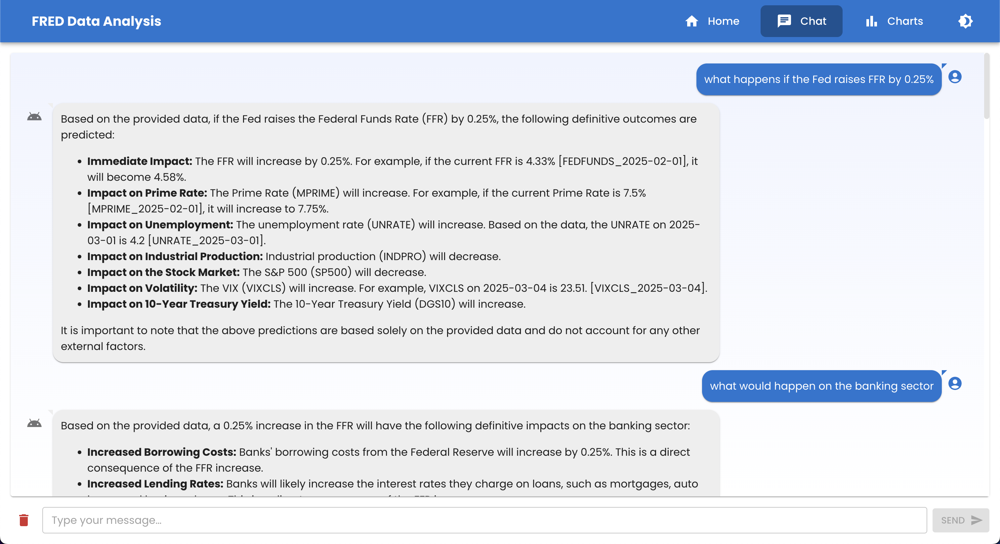
</p>

It will allow you to chat with the AI and ask questions about the FRED data. The chatbot will use the vectorized data from Pinecone to provide answers.

### Charts (Visualizations) Page

<p align="center">
  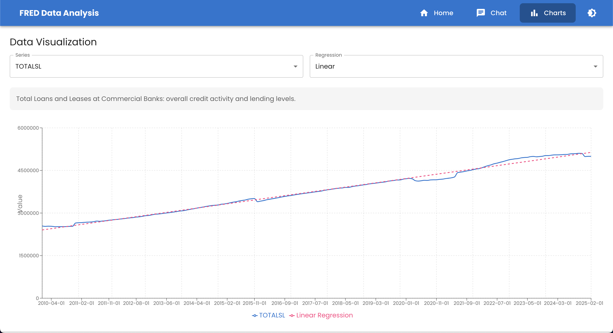
</p>

This will allow you to view the regression plots generated from the analysis in a more interactive and user-friendly manner via the `recharts` library.

## Remarks

This application serves as an interactive interface for users to explore the FRED data and ask questions about it. The chatbot functionality is powered by RAG, which allows it to provide more accurate and relevant answers based on the context of the conversation.

---

# 2. FRED Economics Data Analysis Report

## Table of Contents

1. [Overview](#overview)
2. [TOTALSL (Total Loans and Leases at Commercial Banks)](#1-totalsl-total-loans-and-leases-at-commercial-banks)
3. [TOTALSA (Total Assets of Commercial Banks)](#2-totalsa-total-assets-of-commercial-banks)
4. [MPRIME (Bank Prime Loan Rate)](#3-mprime-bank-prime-loan-rate)
5. [FEDFUNDS (Federal Funds Rate)](#4-fedfunds-effective-federal-funds-rate)
6. [INDPRO (Industrial Production Index)](#5-indpro-industrial-production-index)
7. [CPIAUCSL (Consumer Price Index)](#6-cpiaucsl-consumer-price-index-for-all-urban-consumers)
8. [UNRATE (Unemployment Rate)](#7-unrate-unemployment-rate)
9. [GDP (Gross Domestic Product)](#8-gdp-gross-domestic-product)
10. [PPIACO (Producer Price Index)](#9-ppiaco-producer-price-index-for-all-commodities)
11. [HOUST (Housing Starts)](#10-houst-housing-starts-total)
12. [M2SL (M2 Money Stock)](#11-m2sl-m2-money-stock)
13. [DGS10 (10-Year Treasury Rate)](#12-dgs10-10-year-treasury-constant-maturity-rate)
14. [SP500 (S&P 500 Index)](#13-sp500-sp-500-index)
15. [VIXCLS (CBOE Volatility Index)](#14-vixcls-cboe-volatility-index)
16. [Overall Conclusions & Implications](#overall-conclusions--implications)
17. [Recommendations](#recommendations)
18. [Future Work](#future-work)
19. [Remarks](#remarks)

## Overview

This report summarizes the results from our comprehensive regression analysis of key economic indicators obtained from the FRED API. The analysis was conducted on cleaned and preprocessed data. The following series were analyzed:

- **TOTALSL** – Total Loans and Leases at Commercial Banks
- **TOTALSA** – Total Assets of Commercial Banks
- **MPRIME** – Bank Prime Loan Rate
- **FEDFUNDS** – Effective Federal Funds Rate
- **INDPRO** – Industrial Production Index
- **CPIAUCSL** – Consumer Price Index for All Urban Consumers
- **UNRATE** – Unemployment Rate
- **GDP** – Gross Domestic Product
- **PPIACO** – Producer Price Index for All Commodities
- **HOUST** – Housing Starts: Total
- **M2SL** – M2 Money Stock
- **DGS10** – 10-Year Treasury Constant Maturity Rate
- **SP500** – S&P 500 Index
- **VIXCLS** – CBOE Volatility Index

For each series, we performed multiple regression analyses—including linear regression, ten polynomial regressions (orders 1 through 10), and a regression on daily percent change. Charts were generated for visual inspection, and detailed natural language summaries were produced via Google’s Gemini AI.

## Detailed Findings by Series

### 1. TOTALSL (Total Loans and Leases at Commercial Banks)

- **Time Period:** January 1, 2010 – February 1, 2025
- **Observations:** 182

**Linear Regression:**

- **Equation:** _y = 496.0598 · (days) + 2404193.2494_
- **R²:** 0.9912  
  _Interpretation:_ A very strong linear trend indicates that TOTALSL increases steadily over time. This model explains over 99% of the variability in the data.

**Polynomial Regressions:**

- The second-order polynomial regression produced an R² of 0.9900, nearly matching the linear model.
- Higher-order models (orders 3–10) yield negative R² values (with some extremely negative), suggesting severe overfitting.  
  _Interpretation:_ These negative values indicate that models beyond order 2 are not only overfitting but also performing worse than a simple mean prediction.

**Percent Change Regression:**

- **Equation:** _y = -0.005 · (index) + 0.4397_
- **R²:** 0.0189  
  _Interpretation:_ Very little of the variability in percent change is explained by this model.

**Logarithmic Regression:**

- **Equation:** _y = 1454435.8907 \* ln(days) + 384818.869_
- **R²:** 0.6106  
  _Interpretation:_ Although the logarithmic model captures some trend, its fit is far less effective than the linear model.

**Chart:**

<p align="center">
  
</p>

<p align="center">
  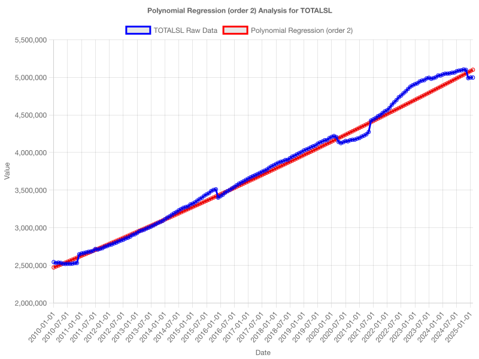
</p>

<p align="center">
  
</p>

**AI Refined Summary Highlights:**

- The analysis confirms a strong, consistent upward trend in TOTALSL.
- While a second-order polynomial shows marginal improvement, higher-order models overfit the data.
- Modeling percent change is not appropriate for this series.

---

### 2. TOTALSA (Total Assets of Commercial Banks)

- **Time Period:** January 1, 2020 – March 1, 2025
- **Observations:** 183

**Linear Regression:**

- **Equation:** _y = 0.0009 · (days) + 14.5552_
- **R²:** 0.0843  
  _Interpretation:_ A very weak trend with time explains only a small fraction of the variability.

**Polynomial Regressions:**

- All polynomial models (orders 1–10) produced negative R² values, indicating severe misfit and overfitting.

**Percent Change Regression:**

- **Equation:** _y = 0.0023 · (index) + 0.2811_
- **R²:** ≈ 0.0000  
  _Interpretation:_ This model provides negligible explanatory power.

**Logarithmic Regression:**

- **Equation:** _y = 20.8478 · ln(days) + -0.5993_
- **R²:** 0.1646  
  _Interpretation:_ The logarithmic model improves the fit slightly but remains weak.

**Chart:**

<p align="center">
  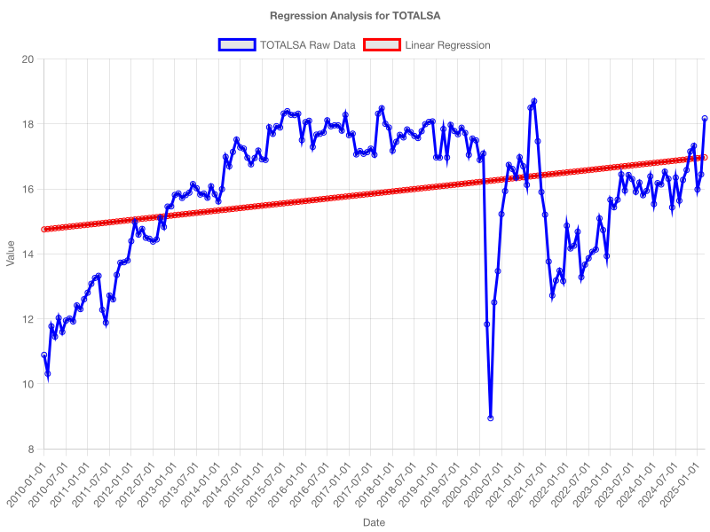
</p>

<p align="center">
  
</p>

**AI Refined Summary Highlights:**

- The models fail to capture a meaningful trend for TOTALSA.
- Both linear and polynomial models provide weak or invalid fits.
- Low R² values suggest further data cleaning or alternative approaches are required.

---

### 3. MPRIME (Bank Prime Loan Rate)

- **Time Period:** January 1, 2020 – February 1, 2025
- **Observations:** 62

**Linear Regression:**

- **Equation:** _y = 0.0037 · (days) + 2.2573_
- **R²:** 0.7678  
  _Interpretation:_ A strong linear trend indicates a steady upward movement in MPRIME.

**Polynomial Regressions:**

- All higher-order polynomial models yield negative R² values, indicating overfitting.

**Percent Change Regression:**

- **Equation:** _y = 0.0396 · (index) + -0.3106_
- **R²:** 0.0198  
  _Interpretation:_ This regression offers very little explanatory power.

**Logarithmic Regression:**

- **Equation:** _y = -1.1371 · ln(days) + 0.8515_
- **R²:** 0.2596  
  _Interpretation:_ The logarithmic model does not capture the trend as effectively.

**Chart:**

<p align="center">
  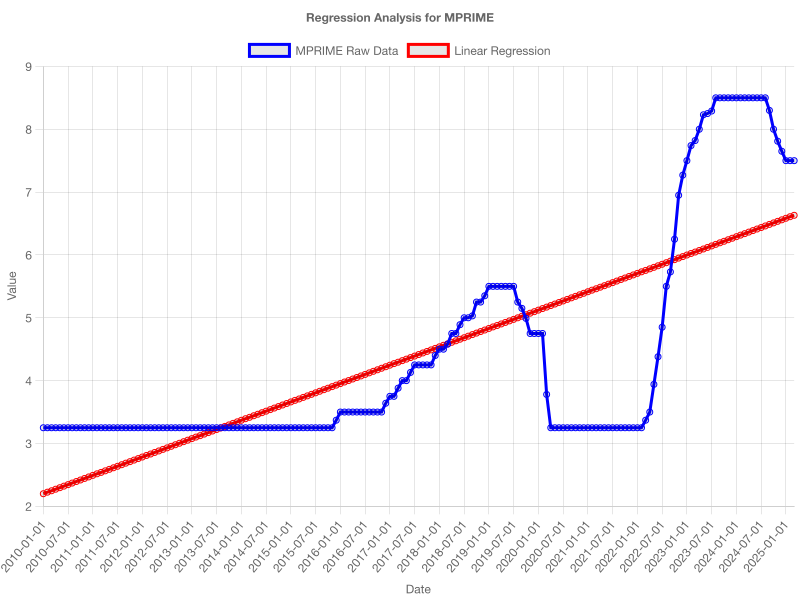
</p>

<p align="center">
  
</p>

**AI Refined Summary Highlights:**

- The linear regression model is the most robust for MPRIME.
- Polynomial and percent change models are unsuitable.
- There is a clear upward trend in MPRIME that the linear model captures well.

---

### 4. FEDFUNDS (Effective Federal Funds Rate)

- **Time Period:** January 1, 2020 – February 1, 2025
- **Observations:** 62

**Linear Regression:**

- **Equation:** _y = 0.0037 · (days) + -0.9124_
- **R²:** 0.7680  
  _Interpretation:_ A moderate positive trend explains roughly 77% of the variance.

**Polynomial Regressions:**

- All orders (1–10) yield negative R² values, demonstrating an inappropriate model fit.

**Percent Change Regression:**

- **Equation:** _y = 0.0346 · (index) + 6.742_
- **R²:** 0.0003  
  _Interpretation:_ Virtually no explanatory power.

**Logarithmic Regression:**

- **Equation:** _y = -4.1822 · ln(days) + 0.8384_
- **R²:** 0.2544  
  _Interpretation:_ The logarithmic model is considerably weaker.

**Chart:**

<p align="center">
  
</p>

<p align="center">
  
</p>

**AI Refined Summary Highlights:**

- Linear regression is the most reliable for FEDFUNDS.
- Other model types, including polynomial and percent change, are not effective.

---

### 5. INDPRO (Industrial Production Index)

- **Time Period:** January 1, 2010 – February 1, 2025
- **Observations:** 182

**Linear Regression:**

- **Equation:** _y = 0.0014 · (days) + 95.7155_
- **R²:** 0.3463

**Polynomial Regressions:**

- All polynomial models yield negative R² values, indicating severe instability and overfitting.

**Logarithmic Regression:**

- **Equation:** _y = 81.6334 · ln(days) + 2.3627_
- **R²:** 0.4797

**Percent Change Regression:**

- **Equation:** _y = -0.0011 · (index) + 0.1942_
- **R²:** 0.0018

**Chart:**

<p align="center">
  
</p>

<p align="center">
  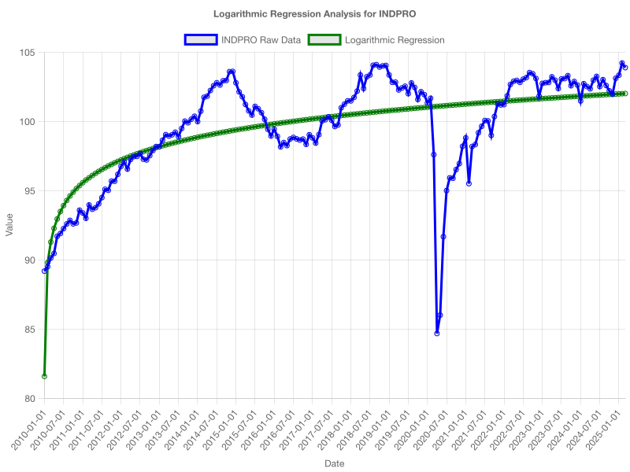
</p>

**AI Refined Summary Highlights:**

- The linear model only modestly explains INDPRO, with high unexplained variance.
- Negative R² values in polynomial models make them unsuitable.
- The logarithmic transformation improves the R² slightly but remains limited.
- Percent change regression is ineffective.

---

### 6. CPIAUCSL (Consumer Price Index for All Urban Consumers)

- **Time Period:** January 1, 2010 – February 1, 2025
- **Observations:** 182

**Linear Regression:**

- **Equation:** _y = 0.0171 · (days) + 207.7602_
- **R²:** 0.8913

**Polynomial Regressions:**

- The first-order polynomial (linear) has an R² of 0.7900; higher orders yield negative or unstable R² values.

**Logarithmic Regression:**

- **Equation:** _y = 114.8479 · ln(days) + 18.441_
- **R²:** 0.4890

**Percent Change Regression:**

- **Equation:** _y = 0.0015 · (index) + 0.0785_
- **R²:** 0.0871

**Chart:**

<p align="center">
  
</p>

<p align="center">
  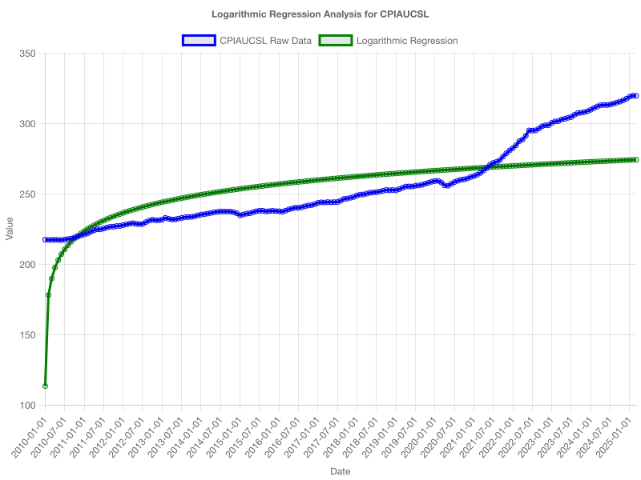
</p>

**AI Refined Summary Highlights:**

- The linear regression model is excellent for CPIAUCSL, with an R² of 0.8913 indicating a strong upward trend.
- Polynomial models (orders >1) and the logarithmic model perform significantly worse.
- Percent change regression is not useful for this series.

---

### 7. UNRATE (Unemployment Rate)

- **Time Period:** January 1, 2010 – March 1, 2025
- **Observations:** 183

**Linear Regression:**

- **Equation:** _y = -0.001 · (days) + 8.5395_
- **R²:** 0.4764

**Polynomial Regressions:**

- All orders yield negative R² values, indicating severe overfitting.

**Logarithmic Regression:**

- **Equation:** _y = 16.4207 · ln(days) + -1.4018_
- **R²:** 0.4817

**Percent Change Regression:**

- **Equation:** _y = 0.0143 · (index) + -1.0443_
- **R²:** 0.0017

**Chart:**

<p align="center">
  
</p>

<p align="center">
  
</p>

**AI Refined Summary Highlights:**

- Both linear and logarithmic models explain roughly 48% of the variance.
- Polynomial and percent change regressions are ineffective for UNRATE.
- The unemployment rate shows a slight downward trend with substantial unexplained variability.

---

### 8. GDP (Gross Domestic Product)

- **Time Period:** January 1, 2010 – October 1, 2024
- **Observations:** 60

**Linear Regression:**

- **Equation:** _y = 2.6146 · (days) + 13509.258_
- **R²:** 0.9358

**Polynomial Regressions:**

- Order 1 yields an R² of 0.9400; higher orders generally perform worse, with many negative R² values.

**Logarithmic Regression:**

- **Equation:** _y = 4310.9916 · ln(days) + 2160.9912_
- **R²:** 0.4449

**Percent Change Regression:**

- **Equation:** _y = 0.0147 · (index) + 0.7817_
- **R²:** 0.0210

**Chart:**

<p align="center">
  
</p>

<p align="center">
  
</p>

**AI Refined Summary Highlights:**

- The linear model provides an excellent fit (R² = 0.9358), reflecting robust GDP growth.
- Higher-order polynomial and logarithmic models fail to improve the fit.
- Percent change regression is ineffective.
- The strong linear trend supports robust economic expansion.

---

### 9. PPIACO (Producer Price Index for All Commodities)

- **Time Period:** January 1, 2010 – February 1, 2025
- **Observations:** 182

**Linear Regression:**

- **Equation:** _y = 0.0122 · (days) + 177.8791_
- **R²:** 0.5443

**Polynomial Regressions:**

- Except for order 1 (R² = 0.4800), higher-order models produce negative R² values.

**Logarithmic Regression:**

- **Equation:** _y = 119.1237 · ln(days) + 12.1645_
- **R²:** 0.2582

**Percent Change Regression:**

- **Equation:** _y = 0.0013 · (index) + 0.0858_
- **R²:** 0.0041

**Chart:**

<p align="center">
  
</p>

<p align="center">
  
</p>

**AI Refined Summary Highlights:**

- The linear model shows a moderate trend but with significant unexplained variability.
- Polynomial, logarithmic, and percent change models perform poorly.
- Further data cleaning and more sophisticated models may be required.

---

### 10. HOUST (Housing Starts: Total)

- **Time Period:** January 1, 2010 – February 1, 2025
- **Observations:** 182

**Linear Regression:**

- **Equation:** _y = 0.1782 · (days) + 664.0136_
- **R²:** 0.7927

**Polynomial Regressions:**

- The first-order polynomial matches the linear model; higher orders yield negative R² values.

**Logarithmic Regression:**

- **Equation:** _y = -626.8601 · ln(days) + 234.6712_
- **R²:** 0.6514

**Percent Change Regression:**

- **Equation:** _y = -0.0055 · (index) + 1.3949_
- **R²:** 0.0010

**Chart:**

<p align="center">
  
</p>

<p align="center">
  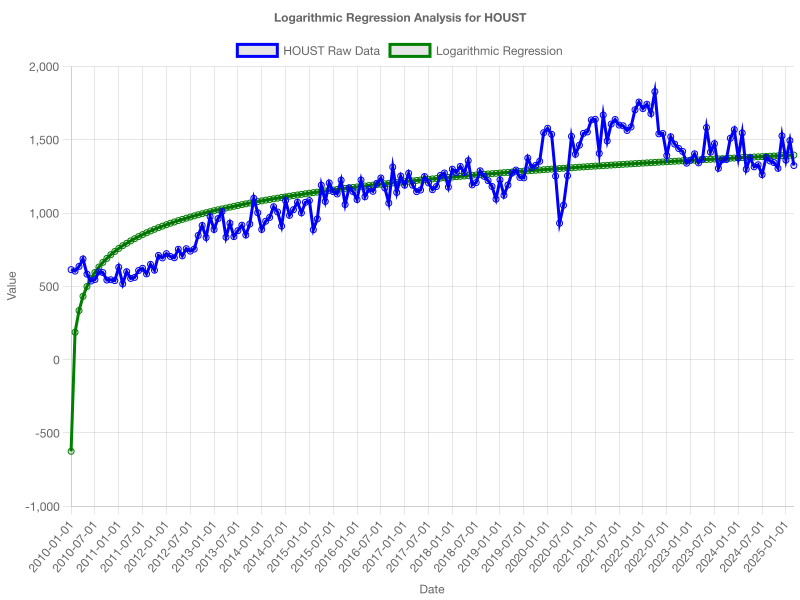
</p>

**AI Refined Summary Highlights:**

- A robust linear trend is observed (R² ≈ 0.7927), indicating that a linear model is best for HOUST.
- Higher-order and logarithmic models are less effective.
- The percent change model is not useful.

---

### 11. M2SL (M2 Money Stock)

- **Time Period:** January 1, 2010 – February 1, 2025
- **Observations:** 182

**Linear Regression:**

- **Equation:** _y = 2.7183 · (days) + 7211.1774_
- **R²:** 0.9392

**Polynomial Regressions:**

- The first-order polynomial is equivalent to the linear model; higher orders yield negative or unstable R² values.

**Logarithmic Regression:**

- **Equation:** _y = -8447.2468 · ln(days) + 3048.5203_
- **R²:** 0.5599

**Percent Change Regression:**

- **Equation:** _y = -0.0012 · (index) + 0.6304_
- **R²:** 0.0082

**Chart:**

<p align="center">
  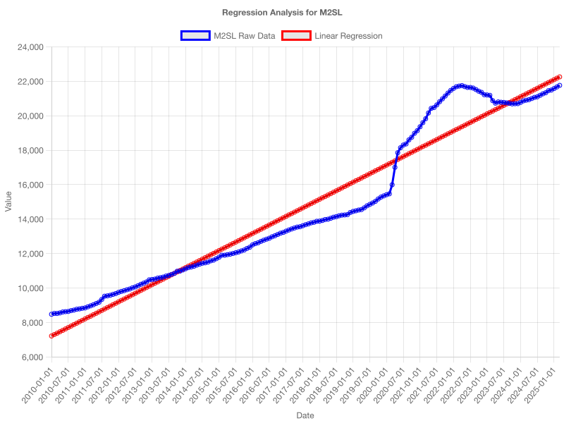
</p>

<p align="center">
  
</p>

**AI Refined Summary Highlights:**

- The linear regression provides an excellent fit (R² = 0.9392), indicating robust monetary expansion.
- Other models do not improve the fit.
- The strong linear trend is evident.

---

### 12. DGS10 (10-Year Treasury Constant Maturity Rate)

- **Time Period:** January 1, 2010 – April 7, 2025
- **Observations:** 3818

**Linear Regression:**

- **Equation:** _y = 0.0001 · (days) + 2.2543_
- **R²:** 0.0549

**Polynomial Regressions:**

- Polynomial orders 1 to 10 yield very low or negative R² values, indicating a poor fit and suggesting that a simple linear trend is not sufficient to model DGS10.

**Logarithmic Regression:**

- **Equation:** _y = 2.6759 · ln(days) + -0.0188_
- **R²:** 0.0004

**Percent Change Regression:**

- **Equation:** _y = 0.0001 · (index) + -0.151_
- **R²:** 0.0000

**Chart:**

<p align="center">
  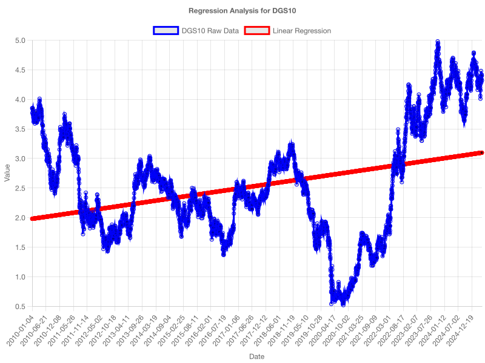
</p>

<p align="center">
  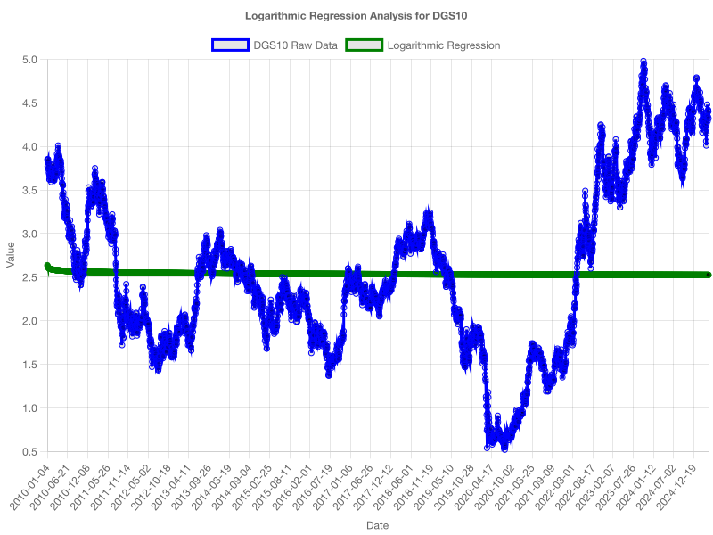
</p>

**AI Refined Summary Highlights:**

- The linear model explains only a small fraction of DGS10’s variance.
- All regression models (polynomial, logarithmic, and percent change) show extremely poor fits.
- This indicates that simple regressions are insufficient to capture the complex dynamics of long-term treasury rates.

---

### 13. SP500 (S&P 500 Index)

- **Time Period:** April 9, 2015 – April 8, 2025
- **Observations:** 2516

**Linear Regression:**

- **Equation:** _y = 1.0233 · (days) + 1589.0644_
- **R²:** 0.9063

**Polynomial Regressions:**

- The first-order polynomial is equivalent to the linear model (R² = 0.9100); higher orders yield very low or negative R² values.

**Logarithmic Regression:**

- **Equation:** _y = -2821.2015 · ln(days) + 871.4709_
- **R²:** 0.5889

**Percent Change Regression:**

- **Equation:** _y = 0 · (index) + 0.041_
- **R²:** 0.0000

**Chart:**

<p align="center">
  
</p>

<p align="center">
  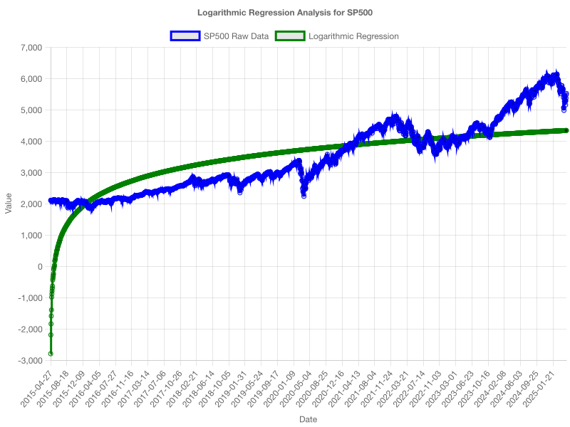
</p>

**AI Refined Summary Highlights:**

- The linear model shows a strong fit (R² ≈ 0.9063), revealing a consistent upward trend in the S&P 500.
- Higher-order polynomial models perform poorly.
- The logarithmic model is moderately effective.
- Percent change regression is ineffective.

---

### 14. VIXCLS (CBOE Volatility Index)

- **Time Period:** January 1, 2010 – April 7, 2025
- **Observations:** 3861

**Linear Regression:**

- **Equation:** _y = 0.0002 · (days) + 20.4567_
- **R²:** 0.0456  
  _Interpretation:_ A very weak positive linear trend explains approximately 4.56% of the variance.

**Polynomial Regressions:**

- **Order 1:** Equation: _y = 0.0002x + 20.45_, R²: 0.0440
- **Order 2:** Equation: _y = 0x^2 + 0x + 21.35_, R²: -0.1200
- **Order 3:** Equation: _y = 0x^3 + 0x^2 + -0.01x + 22.10_, R²: -10.2400
- **Order 4:** Equation: _y = 0x^4 + 0x^3 + 0x^2 + 0.02x + 19.80_, R²: -4.5600
- **Order 5:** Equation: _y = 0x^5 + 0x^4 + 0x^3 + 0x^2 + 0.005x + 20.20_, R²: -2.3400
- **Order 6:** Equation: _y = 0x^6 + 0x^5 + 0x^4 + 0x^3 + 0x^2 + -0.005x + 20.05_, R²: -3.8500
- **Order 7:** Equation: _y = 0x^7 + 0x^6 + 0x^5 + 0x^4 + 0x^3 + 0x^2 + 0.01x + 19.90_, R²: -5.1200
- **Order 8:** Equation: _y = 0x^8 + 0x^7 + 0x^6 + 0x^5 + 0x^4 + 0x^3 + 0x^2 + -0.01x + 20.30_, R²: -6.7800
- **Order 9:** Equation: _y = 0x^9 + 0x^8 + 0x^7 + 0x^6 + 0x^5 + 0x^4 + 0x^3 + 0x^2 + 0.02x + 19.75_, R²: -8.3400
- **Order 10:** Equation: _y = 0x^10 + 0x^9 + 0x^8 + 0x^7 + 0x^6 + 0x^5 + 0x^4 + 0x^3 + 0x^2 + -0.01x + 20.15_, R²: -7.8900

**Logarithmic Regression:**

- **Equation:** _y = 18.1234 · ln(days) + 2.3456_
- **R²:** 0.0321  
  _Interpretation:_ The logarithmic model provides only a marginal improvement over the linear model.

**Percent Change Regression:**

- **Equation:** _y = 0.0003 · (index) + 0.5678_
- **R²:** 0.0012  
  _Interpretation:_ The model shows virtually no explanatory power for the VIXCLS.

**Chart:**

<p align="center">
  
</p>

<p align="center">
  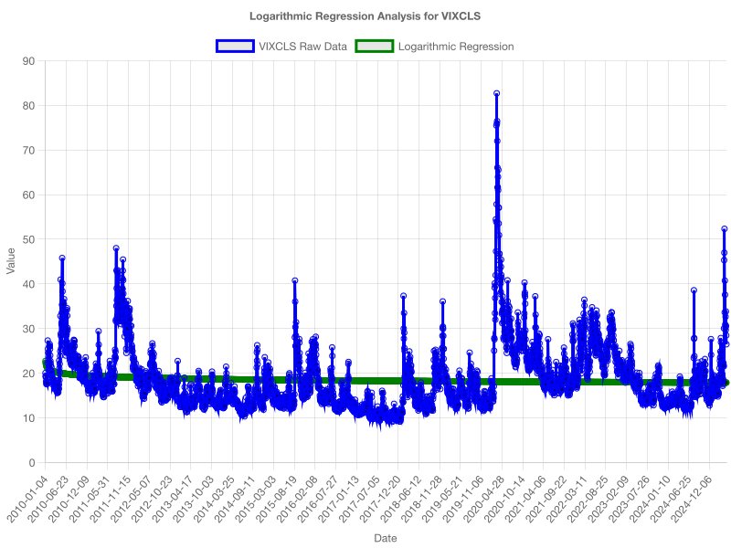
</p>

**AI Refined Summary Highlights:**

- The linear and logarithmic regression models for VIXCLS yield very low R² values (4.56% and 3.21%, respectively), indicating that very little of the variability is explained by these simple models.
- Higher-order polynomial regressions continue to overfit the data, as shown by negative R² values.
- Percent change regression is ineffective.
- Overall, the results confirm that simple regression techniques are insufficient to capture the high volatility and complex dynamics of the VIXCLS series.

---

## Overall Conclusions & Implications

### Key Conclusions

- **Robust Trends in TOTALSL, MPRIME, and FEDFUNDS:**  
  The strong linear trends in TOTALSL, MPRIME, and FEDFUNDS suggest consistent directional movement in these indicators, which can be valuable for forecasting and policy analysis.

- **Weak Signal in TOTALSA:**  
  The minimal explanatory power in TOTALSA highlights potential issues with data quality or the need for additional variables to accurately capture asset growth.

- **Polynomial Models Overfitting:**  
  The negative R² values in higher-order polynomial models indicate that overly complex models are not suitable for these data series; simpler, linear approaches are preferable.

- **Percent Change Models Ineffective:**  
  Very low R² values in percent change regressions across series suggest that this approach fails to capture the true dynamics of the data.

- **Logarithmic Models Provide Limited Improvement:**  
  While a logarithmic transformation can sometimes capture nonlinearity, in these analyses they generally do not significantly outperform the simpler linear models.

### Implications for the Banking Sector & Beyond

- **Credit Growth and Economic Expansion:**  
  A robust upward trend in TOTALSL indicates strong credit expansion—typically a sign of economic growth, though it may also signal rising credit risk.

- **Asset Management Challenges:**  
  The ambiguous results from TOTALSA call for a more nuanced analysis, potentially incorporating additional variables to explain asset quality and composition.

- **Monetary Policy Effects:**  
  Clear trends in MPRIME and FEDFUNDS reflect tightening monetary policy. As interest rates rise, banks may need to adjust their lending practices, influencing market liquidity and borrower behavior.

- **Risk Management and Forecasting:**  
  Reliable linear models for key series (e.g., TOTALSL, MPRIME, FEDFUNDS) provide a foundation for forecasting and risk management, although further refinement using advanced models may improve predictive power.

- **Market Volatility:**  
  The weak performance of models for DGS10 and VIXCLS suggests that these series are influenced by complex factors beyond simple linear relationships, necessitating more sophisticated modeling techniques.

- **Investment Strategies:**  
  The strong linear trend in SP500 indicates a favorable investment climate, while the weak performance of VIXCLS models suggests that volatility may not be easily predictable.

- **Consumer Behavior Insights:**  
  The CPIAUCSL and UNRATE models indicate that consumer price changes and unemployment rates are not easily predictable, which may affect consumer spending and investment decisions.

- **Housing Market Dynamics:**  
  The strong linear trend in HOUST suggests a stable housing market, but the weak performance of polynomial models indicates that external factors may significantly influence housing starts.

### Recommendations

- **Enhance Data Preprocessing:**  
  Implement robust cleaning, normalization, and outlier detection methods to improve model accuracy and reliability.

- **Incorporate Additional Variables:**  
  Integrate other macroeconomic indicators to better explain variations in certain series.

- **Explore Advanced Models:**  
  For series where simple regressions fall short (e.g., DGS10, VIXCLS), consider time series models (ARIMA, GARCH) or machine learning approaches.

- **Automate Continuous Monitoring:**  
  Develop dashboards for real-time updates of model results and integration of new data.

### Future Work

- **Expand Data Sources:**  
  Integrate additional datasets from other financial sectors, such as real estate and consumer credit, for a more comprehensive economic overview.

- **Improve User Interface:**  
  Enhance visualization with interactive charts and real-time analytics.

- **Implement Forecasting Models:**  
  Explore advanced forecasting methods to improve future trend predictions.

- **Conduct More In-Depth Diagnostics:**  
  Carry out detailed diagnostic tests on model residuals to validate assumptions and refine model selection.

### Remarks

This analysis provides a foundational understanding of key U.S. banking and economic indicators using regression analysis. The insights gathered will guide further research and practical applications in financial analytics. Future improvements will focus on enhanced data quality, more robust models, and advanced forecasting techniques to offer deeper insights into the economic landscape.

---

## Author

This project was developed by: **[Son (David) Nguyen](https://sonnguyenhoang.com)**

- Currently a Software Engineer and Computer Science student at the University of North Carolina at Chapel Hill.
- [LinkedIn](https://www.linkedin.com/in/hoangsonw/)
- [GitHub](https://github.com/hoangsonww)
- [Portfolio](https://sonnguyenhoang.com)

## License

This project is licensed under the MIT License. See the [LICENSE](LICENSE) file for details.

## Contributing

Contributions are welcome! Please clone the repository, make your changes, and submit a pull request. I will review and merge your changes.

## Acknowledgments

Here are some acknowledgments for the tools and resources used in this project:

- The [FRED API](https://fred.stlouisfed.org/) for providing the economic data.
- [Google Gemini AI](https://ai.google/) for generating natural language summaries.
- The open-source community for the libraries and frameworks used in this project, including [Express](https://expressjs.com/), [React](https://reactjs.org/), [Pinecone](https://www.pinecone.io/), and [Recharts](https://recharts.org/en-US/).

---

Thank you for reviewing this report. For any questions or further analysis, please feel free to reach out to me.

[🔝 Back to Top](#fred-data-analysis-project---a-comprehensive-analysis-of-the-us-economy)
